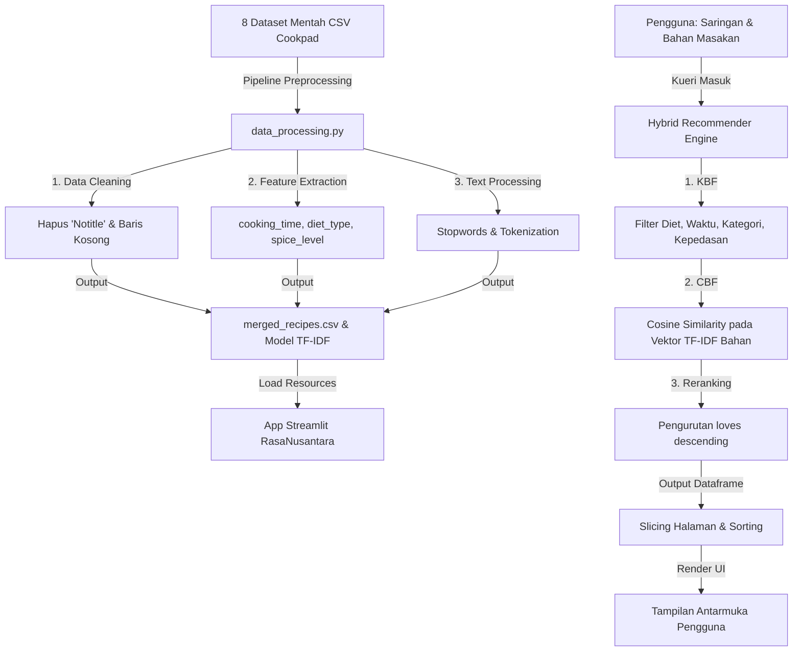

# 🍳 RasaNusantara

[](https://rasa-nusantara.streamlit.app/)
[](https://www.python.org/)
[](https://streamlit.io/)

**RasaNusantara** adalah sistem rekomendasi resep masakan khas Indonesia berbasis kecerdasan buatan. Aplikasi ini dirancang secara khusus dengan pendekatan **Hybrid Recommendation System** (menggabungkan *Knowledge-Based Filtering* dan *Content-Based Filtering*) untuk membantu pengguna menemukan menu masakan terbaik berdasarkan ketersediaan bahan dapur, preferensi diet, tingkat kepedasan, serta durasi memasak yang diinginkan.

Aplikasi ini telah di-deploy secara online di: **[rasa-nusantara.streamlit.app](https://rasa-nusantara.streamlit.app/)**

---

## ✨ Fitur Utama

*   **Hybrid Recommendation Engine**:
    *   **Knowledge-Based Filtering (KBF)**: Penyaringan keras berdasarkan preferensi fisik masakan (Jenis Diet, Maksimum Durasi Masak, dan Tingkat Kepedasan).
    *   **Content-Based Filtering (CBF)**: Pencarian kecocokan bahan masakan menggunakan metode pembobotan **TF-IDF (Term Frequency - Inverse Document Frequency)** dan kemiripan sudut **Cosine Similarity**.
    *   **Popularity Re-Ranking**: Mengurutkan ulang rekomendasi teratas berdasarkan popularitas komunitas masakan (**Loves Count**).
*   **Urutkan Resep (Sorting)**: Pengguna dapat menyortir masakan berdasarkan *Paling Relevan*, *Paling Disukai (Loves)*, atau *Waktu Tercepat*.
*   **UI/UX Premium Gourmet**:
    *   **Warm Light Theme**: Desain palet warna krem hangat digital (`#faf7f0`) yang ramah mata dan estetik.
    *   **Premium Typography**: Perpaduan font serif mewah **Cinzel** untuk judul/heading dan **Outfit** (Sans-serif) untuk navigasi/UI.
    *   **Glassmorphic Hero Banner**: Banner transparan tanpa lapisan penutup putih, menonjolkan visual makanan Nusantara secara tajam di belakang kartu teks kaca es (*frosted glass*).
    *   **Segmented Controls**: Desain tombol sidebar dinamis yang modern untuk saringan kesulitan dan kepedasan.
    *   **Airbnb-style Category Selector**: Navigasi kategori kuliner horisontal yang responsif dan elegan di bagian atas halaman utama.
*   **Batch Rendering & Pagination**: Memotong daftar rekomendasi ke dalam sistem halaman (6 resep per halaman) untuk mempercepat performa loading serta kemudahan eksplorasi.
*   **Akordeon Lipat Instan**: Detail bahan dan langkah pembuatan masakan disembunyikan secara default menggunakan tag HTML5 `<details>` dan dapat dibuka langsung tanpa latensi pemuatan ulang server.

---

## 🛠️ Arsitektur Sistem (End-to-End)



---

## 📂 Struktur Proyek

```text
Indonesian-Recipe-Recsys/
├── .devcontainer/         # Konfigurasi container dev env
├── assets/                # Aset gambar dekorasi UI (foto_makanan.jpg)
├── data/
│   ├── raw/               # 8 file CSV mentah berdasarkan kategori bahan dasar
│   └── processed/         # File olahan merged_recipes.csv & model TF-IDF (.pkl)
├── notebooks/             # Eksplorasi Jupyter Notebook (1, 2, dan 3)
├── src/
│   ├── __init__.py
│   ├── data_processing.py # Script pipeline preprocessing data
│   └── recommender.py     # Logika mesin rekomendasi Hybrid
├── app.py                 # Antarmuka Dashboard utama Streamlit
├── requirements.txt       # Daftar pustaka dependency python
└── README.md              # Dokumentasi proyek
```

---

## 🚀 Memulai Lokal (Getting Started)

Ikuti langkah-langkah di bawah ini untuk menjalankan RasaNusantara pada komputer lokal Anda:

### Prasyarat
*   Python 3.12 (Disarankan versi 3.12.5)
*   Git

### Langkah 1: Klon Repositori
```bash
git clone https://github.com/username/Indonesian-Recipe-Recsys.git
cd Indonesian-Recipe-Recsys
```

### Langkah 2: Buat Virtual Environment & Pasang Dependensi
```bash
# Membuat Virtual Env
python -m venv .venv

# Mengaktifkan Virtual Env (Windows Powershell)
.venv\Scripts\Activate.ps1

# Mengaktifkan Virtual Env (Mac/Linux)
source .venv/bin/activate

# Pasang dependency
pip install -r requirements.txt
```

### Langkah 3: Jalankan Preprocessing Data
*Pastikan 8 file dataset mentah sudah berada di folder `data/raw/`*. Jalankan perintah berikut untuk menyaring data cacat, mengekstrak fitur waktu masak, diet, kepedasan, dan melatih pembobotan TF-IDF:
```bash
python src/data_processing.py
```
*Script ini akan memproses total 15.641 resep masakan, membuang 48 baris data cacat/korup, dan menyimpan dataset bersih sebanyak 15.593 resep ke `data/processed/merged_recipes.csv`.*

### Langkah 4: Jalankan Aplikasi Streamlit
```bash
streamlit run app.py
```
Aplikasi secara otomatis akan terbuka di browser Anda pada alamat **`http://localhost:8501`**.

---

## 📝 Ringkasan Pemrosesan Data & Feature Engineering

1.  **Cooking Time Extraction**: Menggunakan pola ekspresi reguler (Regex) untuk mencari durasi waktu masak dari teks langkah pembuatan. Median masakan Indonesia dihitung sebesar **20 menit**.
2.  **Diet Type Classification**: Menentukan menu vegetarian menggunakan penyaringan ganda (kata kunci non-vegetarian + filter kategori instan untuk *Sapi, Kambing, Ayam, Ikan, Udang*).
3.  **Spice Level Calculation**: Menghitung bobot kepedasan berdasarkan frekuensi kata kunci bumbu pedas lokal seperti *cabe, rawit, rica, lada, merica, cabai, sambal, balado*.
4.  **TF-IDF & Cosine Similarity**: Memanfaatkan `TfidfVectorizer` (ngram_range 1 s.d 2) untuk mengukur bobot setiap bahan unik masakan. Kemiripan resep diukur dengan Cosine Similarity dengan ambang batas kecocokan minimal $\ge 0.05$.

---

## 👥 Pengembang & Pembimbing

*   **Mahasiswa**: Raja Rahman Aziiz (NRP: 332460045)
*   **Dosen Pengampu**: Ronny Susetyoko S.Si., M.Si
*   **Institusi**: Politeknik Elektronika Negeri Surabaya (PENS)
